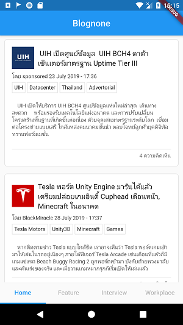
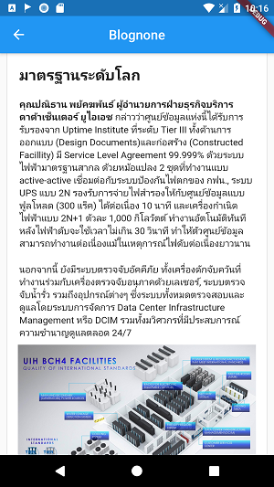
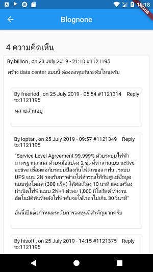

# Flutter Blognone

Flutter Package สำหรับดึงหัวข้อข่าวและเนื้อหาข่าวในเว็บไซต์ [blognone.com](https://www.blognone.com)
ขอเรียนว่า package ดังกล่าวนี้ เป็นการพัฒนาจากนักพัฒนาภายนอก ไม่ได้ถูกพัฒนาโดยทีมงานของ blognone

## การติดตั้ง
เพิ่ม dependencies ในไฟล์ pubspec.yaml

```bash
flutter_blognone: 1.0.0
```

จากนั้น import flutter_blognone มายังไฟล์ dart ในโปรเจคของคุณ

```dart
import 'package:flutter_blognone/flutter_blognone.dart';
```

## การใช้งาน

สร้างตัวแปร instance ของ FlutterBlognone

```dart
var bn = FlutterBlognone();
```

### เรียกดูหัวข้อข่าว

เรียกหัวข้อข่าวจากเว็บไซต์ blognone โดยการกำหนดค่า page (เริ่มต้นที่ 0 คือข่าวในหน้าแรก)

```dart
var listNode = await bn.fetchNodeTitleList(page: 0);
for(var node in listNode){
    // node.id;
    // node.title;
    // node.urlImage;
    // node.content;
    // node.countComment;
    // node.isSticky;
    // node.date;
    // node.writer;
    // node.tags;
}
```

### เรียกดูหัวข้อข่าว (Feature)

เรียกหัวข้อข่าวจากเมนู feature ใน blognone

```dart
var listNode = await bn.fetchNodeTitleListFeature();
```

### เรียกดูหัวข้อข่าวบทสัมภาษณ์ (Interview)

เรียกหัวข้อข่าวจากเมนู interview ใน blognone

```dart
var listNode = await bn.fetchNodeTitleListInterview();
```


### เรียกดูหัวข้อข่าวบทสถานที่ทำงาน (Workplace)

เรียกหัวข้อข่าวจากเมนู workplace ใน blognone

```dart
var listNode = await bn.fetchNodeTitleListWorkplace();
```

### เรียกดูหัวข้อข่าวจากแท็ก (Tag หรือ Topic)

เรียกหัวข้อข่าวจาก tag ใน blognone

```dart
var listNode = await bn.fetchNodeTitleListByTag(tag: "Microsoft");
```

### เรียกดูเนื้อหาข่าว

แสดงเนื้อหาภายในข่าว โดยกำหนดค่า nodeId หรือหมายเลข id ของข่าว
เช่น [https://www.blognone.com/node/111060](https://www.blognone.com/node/111060)
หมายเลข id ของข่าวคือ 111060

ค่าของ contentFull เป็น String รูปแบบ HTML ดังนั้นควรใช้ร่วมกับ WebView หรือ Widget ที่แสดง HTML ได้

```dart
var nodeContent = await bn.fetchNodeContentList(nodeId: id);
// nodeContent.id;
// nodeContent.isSticky;
// nodeContent.contentFull;
// nodeContent.title;
// nodeContent.writer;
// nodeContent.date;
// nodeContent.tags;
// nodeContent.urlImage;
// nodeContent.comments;
}
```

### เรียกดูความคิดเห็นและการตอบกลับ

ความคิดเห็นนั้นจะอยู่ใน NodeContent (เนื้อหาข่าว) ดังนั้นคุณสามารถดึงความคิดเห็นจากเนื้อหาข่าวได้ จากตัวแปร comments
โดยตัวแปร html ใน comments คือ HTML ทั้งหมดใน section ของ comment

การดึงค่าของ reply ใน comment สามารถใช้ ตัวแปร items ใน Comment ซึ่งเป็น List ที่มี generic type เดียวกันกับ Comment

```dart
var nodeContent = await bn.fetchNodeContentList(nodeId: id);
var comments = nodeContent.comments;
// comments.html;
// comments.countComment;
for(var comment in comments.items){
    // comment.id;
    // comment.username;
    // comment.avatar;
    // comment.datetime;
    // comment.content;
    if(comment.isReplyComment) {
        // comment.replyTo;
    }
    if(comment.hasReply) {
        // comment.items;
    }
}
```

### ตัวอย่าง

คุณสามารถลองนำโปรเจคในโฟลเดอร์ example รัน เพื่อดูตัวอย่างการใช้งาน



